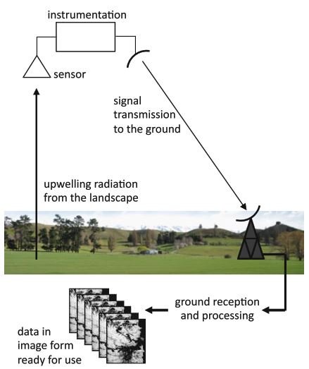

The first important concept in this course is to appreciate what we mean by the term remote sensing. 

In simple terms, remote sensing is the technology of recording images or portions of the Earth's surface from spacecraft, aircraft or other platforms in order to understand the surface by analyzing and interpreting those images. 

However, image interpretation isn't a simple task. So it is important to understand how the images are acquired in the first instance and whether those images contain any forms of error, or distortion. 

## How Image is Formed from Satellites

We start with looking at how energy coming from the Earth's surface can be made into an image. 

The Image in the above figure shows a remote sensing system consisting of a sensor which can detect energy coming from the Earth's surface, followed by some form of instrumentation, which can convert that measured energy into an electrical signal, and a means for sending that signal to the Earth's surface. On the ground, the signal is composed into the form of images of the landscape. Over which the platform has flown. Sometimes the images are formed in recorded on the platform itself and then downloaded when the platform returns to the earth's surface. That is often the case for aircraft remote sensing or when drones are used to form images of the earth. The energy that the sensor detects is most often just sunlight reflected from the earth's surface, just like we say the landscape from the window of an aeroplane. Alternatively, though, it could be the natural heat energy emanating from the earth. Or it could even be energy scattered from the surface as a result of some form of artificial illumination. A typical example of that would be scattered radio waves in the case of radar imaging, which we will say a little more about later. 

I would like to look at remote sensing in four blocks. This is like the system view of remote sensing. 

- The first block is the energy that is detected by the platform. And as I said previously, that could be scattered sunlight. Pick from the Earth itself or scattered radiation from incident radio waves. 

- The second block is the downlinking of the signal which carries the information recorded by the detector followed by the subsequent translation of that electrical signal into imagery. This normally occurs in a suitable facility on the ground. 

- Thirdly, in any real system, the images recorded by the platform will have embedded errors. There can be errors in brightness and contrast relative to the actual brightness and contrast of the scene being imaged. But there can also be errors in the geometry of the image compared with the spatial arrangement of features on the Earth's surface. When we get to the end of block three, in other words, once those errors have been corrected, we have images in a form that can be used in applications. The images are ready to be interpreted, either by skilled analysts or by an analyst with the assistance of suitable computer algorithms. It is this last point that forms a major focus of this course. In other words, the first three blocks get the data ready, and the last block is the interpretation and application. That doesn't mean we can ignore the first three, they are important at the early stages of our understanding of remote sensing. 

  Well, most of the material to be presented in this course, will be concerned with the analysis of images and thus we might tend to refer to the course as a treatment of image analysis and processing. Our principal objective is the science of remote sensing. That is how we can use images from satellites, aircraft and drones to help us understand what is on the landscape below the platform. We might be interested for example, in the distribution of natural features on the surface. We might want to understand how the landscape has being managed. We might want to estimate the areas of crops and firsts. We might be interested in mineral exploration and geology. We might just want to understand how the landscape evolves with time. These are all objectives of remote sensing, but to achieve these objectives we need to engage in the process of computer based image interpretation. 

  So, and this is an important point. It is important at all times during our course, that we keep in mind that the end point is remote sensing and not image processing for its own sake. To that end, we need to understand something about the properties of the surface and the importance of the wavelengths used to form images. 

  When thinking about the design of an imaging instrument, our first consideration has to be what wavelengths the system should be capable of recording. In principle, we could use any conceivable wavelength with which to image the earth's surface. And we are guided in this by our own experience. For example, when we look at the landscape, we view the earth effectively in the three primary colors of blue, green and red, which correspond to the color receptors in our eyes as it is depicted in {@fig:electromagnetic_spectrum}.

  They are then combined additively to produce the range of colors and brightness to give us the natural set of Landsat colors that we observe. But there are, of course, a whole lot of other wavelengths that we are not capable of seeing. The ultraviolet and infrared ranges are examples. Even though we don't ourselves see detail outside the range of human vision. Imagery does emanate or scatter from the earth of a great range of wavelengths not available to us but measurable by satellite sensor. We will see shortly that significant amounts of information about the landscape can be gained if we form images in those other wavelength ranges. Which are the best wavelengths to use? Before we can answer that, we need to understand a little about the atmosphere and how it affects what a sensor can measure. That is the topic of the next lecture. 

  At the end of each lecture, we have a summary of the important points from the lecture. 

  Each of our lectures concludes with such a summary. Sometimes these summarize we will add a little more detail and include some points that lead us to think about matters which will be traded in later lectures. 

  It is important therefore, not to skip the summaries. Please go back over the lecture as you tick off each point in the summary. And think carefully about matters that sent the supplement what was presented in the lecture. 

  We also have a quiz at the end of each lecture. 

  In the simple quizzes, we set specific questions that again reinforce the lecture just presented, but also sometimes ask you to think more widely about matters. Many of which are designed as preparation for the next or later lecture. Solutions are provided, but it would be good if you could work through the questions before consulting those solutions. 

  The important point though, is to learn as much as possible from the quiz questions. Therefore, if necessary, consult the solutions.


