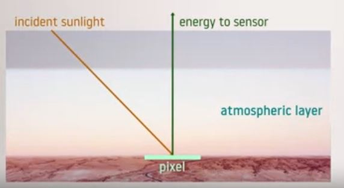
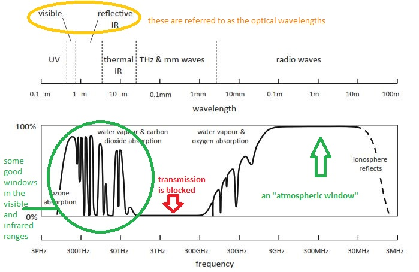
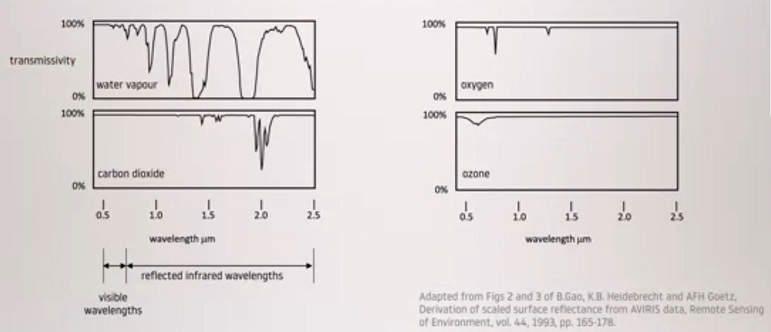

## The atmosphere
As we suggested at the end of the previous lecture, we need to understand a bit about the atmosphere and how it affects the ability to form images of the landscape. In this lecture, we will discuss the properties of the atmosphere and show how it limits the ability to image the earth's surface in certain wavelength ranges while making imaging possible at other wavelengths. 

{#fig:atmoshpheric_layer}

The most obvious effect of the atmosphere is that it sits between the source of energy and the earth's surface and also between the earth's surface and the sensor. Therefore, the energy from the sun reflecting from a spot on the earth's surface has to travel through the atmospheric column in both directions. Incidentally, we have represented the spot of interest on the ground as a pixel since we will be looking at images in this course. We will see shortly that the effect of the atmosphere on the transmission of radiation is wavelength dependent. More importantly, we need to understand whether radiation can passthrough the atmosphere at all.

{#fig:electromagnetic_spectrum}

The figure in  @fig:electromagnetic_spectrum is quite a complicated figure  and we will spend a bit of time on it. At the top, it shows the electromagnetic spectrum from the ultraviolet through to at long radio waves. In the infrared range, it is separated into reflective and thermal infrared. The reasons for this will be seen later. We have also separately identified the tera hertz and millimeter wave range. Note that together, we group the visible and reflective infrared wavelength ranges under the single title of optical wavelengths. On the bottom half of figure @fig:electromagnetic_spectrum, we show the transmission of the atmosphere as a function of wavelength. Sometimes transmission is expressed as transmittance or transmissivity but 100 percent means full transmission, zero means the atmosphere totally blocks radiation. As we can see, this is a very complex graph and the only wavelengths for which the atmosphere seems to be totally transparent is in the range of radio waves. Well, that is very reassuring because it means that a clear atmosphere does not affect radio, television, and mobile or cell phone calls. In the terahertz and millimeter wave range, the transmittance of the atmosphere is almost zero, which means those waves are almost entirely blocked by the atmosphere. In the visible and infrared ranges, while the atmosphere is not entirely transparent, it does allow significant transmission of electromagnetic radiation. There are certain small selected bands where radiation is blocked, but there are plenty of wavelengths where good transmission is possible. The reasons for the atmosphere absorbing radiation at certain wave lengths are several and complex. At the shorter wavelengths, atmospheric ozone is a strong absorber. At most other wavelengths, water vapor and carbon dioxide selectively absorb radiation as indicated in the diagram. At the long radio wavelengths, the layer in the upper atmosphere called the ionosphere significantly refracts radiation, so that those frequencies are also unusable for imaging purposes. The wavelength ranges large or small, over which the atmosphere shows good transmittance are called atmospheric windows.

{#fig:levels_of_energy}

The figure in @fig:absorvation_in_atmospheric_constituents just shows a bit more detail. As we noted on the figure @fig:electromagnetic_spectrum , the principle atmospheric constituents which absorb radiation in the ranges of interest to remote sensing images are water vapor and carbon dioxide. Fig @fig:absorvation_in_atmospheric_constituents shows graphs of the transmissivity or transmittance of those two constituents over the visible and infrared along with the transmissivity of oxygen and ozone. As seen, the latter are much less important than water vapor and carbon dioxide at those wavelengths. 

{#fig:absorvation_in_atmospheric_constituents}

By way of a summary, we can conclude that the most suitable ranges of wavelengths for imaging the earth's surface through its atmosphere are the visible and lower end of the reflective infrared range, sometimes called the near infrared. As a result, if we examine the optical sensors used on most remote sensing satellites, we will see that they tend to have imaging capabilities some where within that broad range. However, we will see that there are other wavelengths that can be used if we re-examine the transmission properties of the atmosphere of the full wavelength range. 

Returning to our previous graphs, we see that there is a reasonably good atmospheric window in the thermal infrared, that is the heat range and exceptionally good transmission for radio waves. Thermal remote sensing satellites, that is those that detect heat emanating from the earth's surface, operate with wave lengths in the range of about 3-5 micrometers. Those satellites can form heat maps of the earth's surface and are particularly good for detecting burning bush and wildfires. Because there's very little natural radio energy emanating from the earth itself, it is usual to irradiate the surface with an artificial source of energy if we wish to take advantage of the very broad atmospheric window in the radio waves range. The remote sensing platform then carries a radio receiver, which is so configured that it forms an image of the surface at radio wavelengths. That is the basis of the very large field of radar remote sensing. Sometimes we do form images of the natural microwave emissions of the surface but because the energy levels are so low, they tend to have very poor spatial resolution. We will not look at thermal remote sensing in any detail in this course, but we will spend some time on radar remote sensing in the last half of module 3. Irrespective of the image top, however, the image analysis techniques we will look at in this course can in principle be applied to any imagery. 

In summary, the important message from this lecture is that the atmosphere interferes selectively with the passage of electromagnetic radiation. When designing a remote sensing program, attention must be paid to those portions of the spectrum which allow reasonable transmission of radiation. We will see that in a later lecture. 

In addition to this set of quiz questions, you might like to think about how you would design a remote sensing imager to map the surfaces of Mars and Venus, that requires you to think a bit about the atmospheres of those planets and the particular challenge of seeing the surface of Venus.

> ## Quiz
>
> 1. Mobile (cell) phones operate at wavelengths of about 1GHz to 2GHz. Would you expect mobile telephone reception to be affected by atmospheric absorption?
>
> 2. Is atmospheric absorption a problem for us when we image the ground from an aircraft?
>
> 3. Sensors for monitoring fires on the earth’s surface tend to operate at about 3-5mm.  Is the atmosphere a problem for effective imaging?
>
> > ## Solution
> > Looking at the graph of the transmission of the atmosphere we see that the atmosphere is almost, but not quite, totally transparent at those frequencies.  We would expect very little effect of the atmosphere on mobile phone reception.  That is particularly the case because the distances involved between a mobile handset and a nearby cell base station is generally only in the order of 10’s of kilometres, or less.
> > This is essentially a repeat of a question from the last lecture, just to remind us that aircraft remote sensing missions are not significantly affected by atmospheric absorption.  Flying through the atmosphere is another matter—aircraft encounter turbulence, which leads to geometry distortions in recorded imagery.  By contrast, this is less of a problem for satellites.
> > Again, looking at the graph of atmospheric transmission we see there is some significant absorption at those wavelengths.  When monitoring fires from aircraft, which is currently the most common situation, the atmospheric column is rarely large enough to cause serious problems.
> {: .solution}
{: .challenge}


